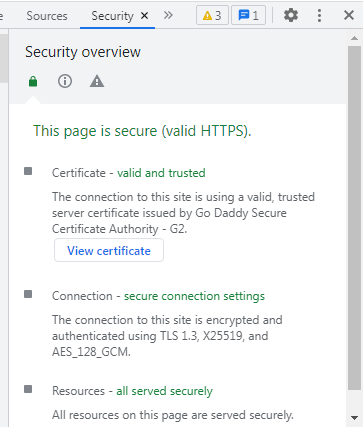

# 🛡 Security

Our code and contracts are fully Open Source and Verified.\
Our Website is equipped with the highest level of Security and a "Ultimate Protection Plan" by www.godaddy.com.

.png>) 

Security advantages for using our Website / DEX

* Turbo SSL Wildcard Certificate
* Highest level of security up to 2048-bit encryption
* High-grade SHA-2 encryption
* Fully Decentralized
* We don't own your crypto
* Open Source Code
* (Smart) Contracts Verified
* Audited (Coming Soon)
