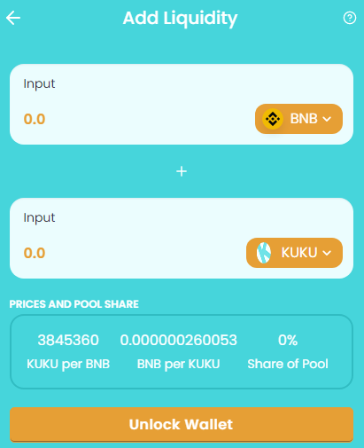

# 💸 Liquidity Provider

**LP Tokens**\
As an example, if you deposited **KUKU** and **BNB** into a Liquidity Pool, you'd receive **PANKUKU-BNB LP** tokens.\
The number of LP tokens you receive represents your portion of the **PANKUKU-BNB** Liquidity Pool.&#x20;


Funds can be redeemed any time, instantly!



Stake your LP Tokens in our Farms and earn even more on your money!



Providing liquidity can be risky!\
Make sure you know about [**Impermanent Loss!**](../../knowledge-center/glossary-and-vocab.md)



Click the link above for adding Liquidity and becoming a Liquidity Provider


