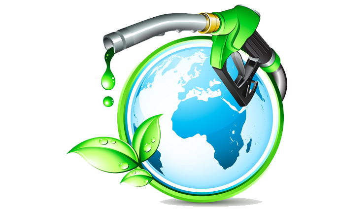

# 🌐 The WORLD Token

<mark style="color:blue;">**Kuku World (WORLD)**</mark> is a <mark style="color:green;">**Tax Free Fueling Token**</mark> for the **KUKU Eco-System**. **Raised Profits** through Special Sales will be used to further develop different **Projects** in the **DeFi Crypto Space**. \
**Holders** of the **WORLD** token gain **SPECIAL ACCESS** to \
**Multiple Online Services** , **Games**, **Movies**, **Discounts** and **many** more **Utilities**. _**Check them out below!**_



<figure><figcaption></figcaption></figure>


**Tax Free**: 0% Buy and Sell Fee



**Modification** of **Tax** and **Fees NOT Possible**



**No Minting** of new tokens (**Capped forever**)



A Tax Free Token: The Users, Community and Traders decide!

